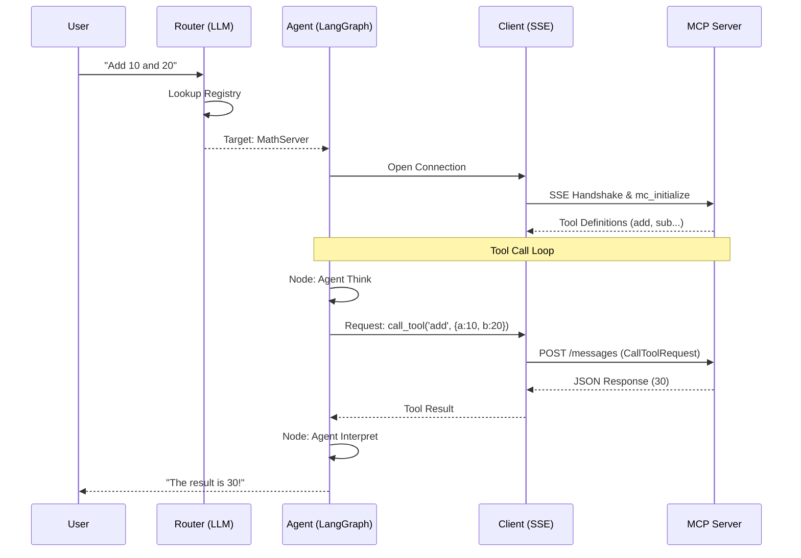
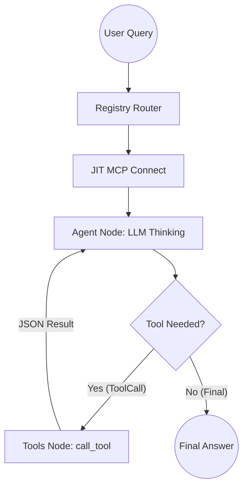

# 🎓 Learn-MCP-LangGraph: A Math Agent Tutorial 🎓

### 🚀 A Practical Guide to LangChain + OpenAI + Model Context Protocol (MCP)

Welcome! This is a educational tutorial designed to show you how to combine **LangChain orchestration**, **OpenAI intelligence**, and the **Model Context Protocol (MCP)** into a functional, multi-server math agent. 🧠🚀

---

## 💡 What You'll Learn

This project is a starting point to help you understand how to navigate a distributed agent architecture. It demonstrates:
1.  🎯 **Simple Routing**: How to use an LLM to select a relevant server from a list.
2.  🔌 **On-Demand Connections**: Opening SSE (Server-Sent Events) connections only when needed.
3.  🔄 **LangGraph Workflow**: Building a basic cyclic graph to manage "thinking" and "tool use."
4.  🛡️ **Schema Integration**: Turning MCP definitions into Pydantic models for LangChain.
5.  🌐 **Hybrid Servers**: Exposing the same logic as both MCP tools and standard FastAPI REST endpoints.

---

## 🗺️ Visualizing the Flow

### 1. The Interaction Lifecycle
This diagram details the "Discovery" through "Execution" phases, specifically highlighting the MCP tool call loop.



### 2. The LangGraph State Machine
The internal logic of `agent.py` driven by the LangGraph framework.



---

## 🚀 Hybrid Server Architecture

The `server.py` is now a **Hybrid Server**. This means it serves two purposes simultaneously:

1.  **MCP Interface**: Provides tools (add, subtract, etc.) and prompts via the Model Context Protocol (SSE) for the LangGraph agent.
2.  **REST Interface**: Provides standard HTTP endpoints (via FastAPI) for direct consumption by web apps or curl.

This pattern is powerful because it allows you to use the same internal logic for both AI agents and traditional software clients.

---

## 🏗️ Project Structure

We've organized the code into three clear parts to make it easy to follow:

| Component | Role | Description |
| :--- | :--- | :--- |
| **`server.py`** | 🧮 **The Hybrid Server** | A FastAPI + FastMCP server providing arithmetic tools via both REST and MCP. |
| **`client.py`** | 🌉 **The Connection Handler** | Manages the SSE handshake and the server registry lookup. |
| **`agent.py`** | 🤖 **The Agent Logic** | The LangGraph definition and the interactive user loop. |

---

## 🚦 Getting Started

### 1️⃣ Setup the Environment 🛠️
We recommend using [uv](https://github.com/astral-sh/uv) for fast dependency management.

```bash
# Install dependencies
uv sync

# Add your OpenAI API key to a .env file
echo "OPENAI_API_KEY=your_sk_key_here" > .env
```

### 2️⃣ Run the Tutorial 🚀

**Step A: Start the MCP Server (Terminal 1)**
```bash
uv run python server.py
```

**Step B: Start the Agent (Terminal 2)**
```bash
uv run python agent.py
```

---

## 🧪 Testing the Server

### 1. Test via REST API (FastAPI)
You can hit the REST endpoints directly using `curl` or your browser:
```bash
# Direct REST call
curl "http://127.0.0.1:8000/add?a=10&b=20"
```

### 2. Explore API Documentation
FastAPI automatically generates interactive documentation for the REST side:
- **Swagger UI**: [http://127.0.0.1:8000/docs](http://127.0.0.1:8000/docs)

### 3. Test via MCP Inspector
You can also test the MCP server independently:

```bash
pnpm dlx @modelcontextprotocol/inspector http://127.0.0.1:8000/sse
```

---

## 📖 Why This Pattern?

-   **Modular Design**: Keeping the connection logic (`client.py`) separate from the AI logic (`agent.py`) makes your code cleaner. 📁
-   **Registry Driven**: By using a `servers.json`, you can easily experiment with adding more (imaginary or real) servers to see how routing works. 📋
-   **LangGraph Visualization**: Using a graph state machine helps you track exactly what the agent is doing at each step. 📈

---

### 🤝 About This Project

This is a learning resource for the developer community. If you have questions or want to suggest improvements to the tutorial, feel free to open an issue or pull request! 🚀🌌

---
*Developed for teaching Advanced Agentic Coding concepts.*
